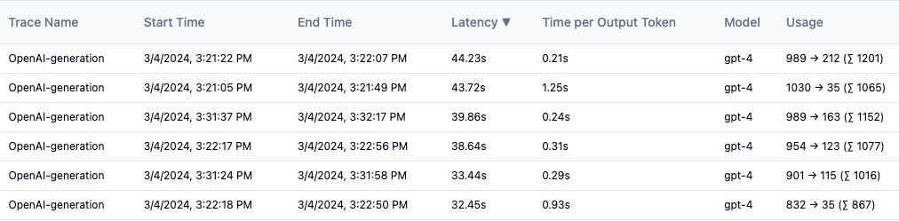

# Langfuse on Azure

Use the [Azure Developer CLI](https://learn.microsoft.com/azure/developer/azure-developer-cli/overview) to deploy [Langfuse](https://langfuse.com/) to Azure Container Apps with PostgreSQL Flexible server.

Langfuse is a platform for LLM observability and evaluation. They provide an open-source SDK and containerized web application to receive the SDK's data. This project deploys the Langfuse web application to Azure Container Apps, and uses PostgreSQL to store the data. It also includes a script to set up Entra-based authentication for the web app. Once you have deployed Langfuse, you can integrate the SDK into your LLM applications according to the [Langfuse documentation](https://langfuse.com/docs/) and start sending data to the web app.

From a deployed Generations tab in Langfuse:



Table of contents:

* [Opening this project](#opening-this-project)
    * [GitHub Codespaces](#github-codespaces)
    * [VS Code Dev Containers](#vs-code-dev-containers)
    * [Local environment](#local-environment)
* [Deploying to Azure](#deploying-to-azure)
* [Disclaimer](#disclaimer)

## Opening this project

You have a few options for setting up this project.
The easiest way to get started is GitHub Codespaces, since it will setup all the tools for you,
but you can also [set it up locally](#local-environment) if desired.

### GitHub Codespaces

You can run this repo virtually by using GitHub Codespaces, which will open a web-based VS Code in your browser:

[](https://github.com/codespaces/new?hide_repo_select=true&ref=main&repo=599293758&machine=standardLinux32gb&devcontainer_path=.devcontainer%2Fdevcontainer.json&location=WestUs2)

Once the codespace opens (this may take several minutes), open a terminal window.

### VS Code Dev Containers

A related option is VS Code Dev Containers, which will open the project in your local VS Code using the [Dev Containers extension](https://marketplace.visualstudio.com/items?itemName=ms-vscode-remote.remote-containers):

1. Start Docker Desktop (install it if not already installed)
1. Open the project:
    [](https://vscode.dev/redirect?url=vscode://ms-vscode-remote.remote-containers/cloneInVolume?url=https://github.com/azure-samples/azure-search-openai-demo)
1. In the VS Code window that opens, once the project files show up (this may take several minutes), open a terminal window.

### Local environment

1. Install the required tools:

    * [Azure Developer CLI](https://aka.ms/azure-dev/install)
    * [Python 3.9, 3.10, or 3.11](https://www.python.org/downloads/) (Only necessary if you want to enable authentication)

2. Create a new folder and switch to it in the terminal.
3. Run this command to download the project code:

    ```shell
    azd init -t langfuse-on-azure
    ```

    Note that this command will initialize a git repository, so you do not need to clone this repository.

4. Create a Python virtual environment and install the required packages:

    ```shell
    pip install -r requirements.txt
    ```
    
5. Open a terminal window inside the project folder.

## Deploying to Azure

Follow these steps to deploy Langfuse to Azure:

1. Login to your Azure account:

    ```shell
    azd auth login
    ```

1. Create a new azd environment:

    ```shell
    azd env new
    ```

    Enter a name that will be used for the resource group.
    This will create a new folder in the `.azure` folder, and set it as the active environment for any calls to `azd` going forward.

1. (Optional) By default, the deployed Azure Container App will use the Langfuse authentication system, meaning anyone with routable network access to the web app can attempt to login to it. To enable Entra-based authentication, set the `AZURE_USE_AUTHENTICATION` environment variable to `true`:

    ```shell
    azd env set AZURE_USE_AUTHENTICATION true
    ```

    Then set the `AZURE_AUTH_TENANT_ID` environment variable to your tenant ID:

    ```shell
    azd env set AZURE_AUTH_TENANT_ID your-tenant-id
    ```

1. Run this command to provision all the resources:

    ```shell
    azd provision
    ```

    This will create a new resource group, and create the Azure Container App and PostgreSQL Flexible server inside that group.
    If you enabled authentication, it will use the `auth_init.sh` and `auth_update.sh` hooks to set up the necessary resources for Entra-based authentication, and pass the necessary environment variables to the Azure Container App.

1. Once the deployment is complete, you will see the URL for the Azure Container App in the output. You can open this URL in your browser to see the Langfuse web app.

## Disclaimer

Langfuse is an external project and is not affiliated with Microsoft.
